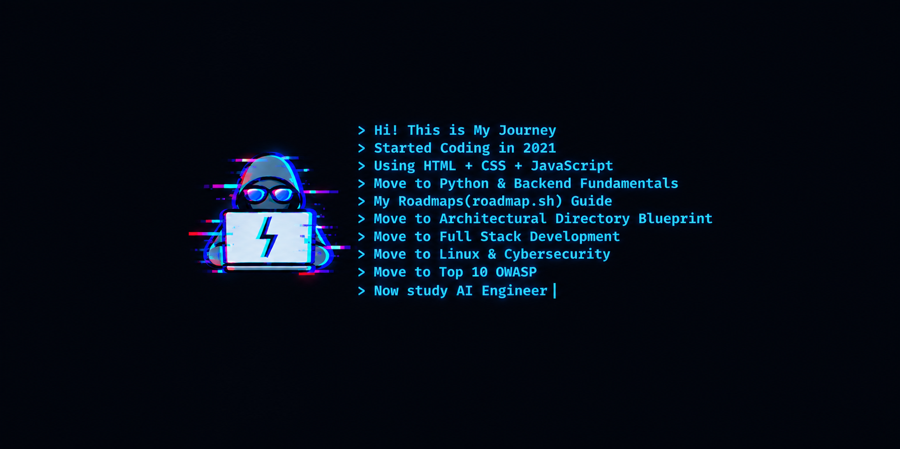

<!-- ANIMATED HEADER BANNER -->
<p align="center">  </p> <!-- TYPING ANIMATION SUBTITLE --> <p align="center">

<!-- TYPING ANIMATION SUBTITLE -->
<p align="center">
  
  <a href="https://git.io/typing-svg">
    
  </a>
</p>
<!-- CONTACT BADGES -->
<p align="center">
  <a href="mailto:johnstevenimperialcaspe08@gmail.com"></a>
  <a href="tel:+639948172661"></a>
  
</p>

---

```console
ragnvindr08:~$ whoami
JOHN STEVEN I. CASPE

ragnvindr08:~$ cat roles.txt
Backend Developer
FastAPI & Python Specialist
AI & Automation Engineer
Cybersecurity & Linux Enthusiast

ragnvindr08:~$ cat contact.txt
Email    : johnstevenimperialcaspe08@gmail.com
Phone    : +63 994 817 2661
Location : Quezon City, PH
```

---

##  About Me
<p align="center">
  
</p>

```console
ragnvindr08:~$ cat about.md
BSIT Graduate (2026) and Backend Engineer specializing in building, architecting, and testing secure RESTful APIs using
Python and FastAPI. Proven hands-on experience through a comprehensive backend internship managing data layers with
PostgreSQL and JSON payloads. Adept at maximizing development speed by integrating AI-assisted engineering tools like
Cursor, GitHub Copilot, Claude, and ChatGPT. Possesses a strong infrastructural baseline in Linux environment
hardening (Ubuntu, Kali) and Cisco Cybersecurity principles to systematically defend application architectures. Actively
transitioning core backend architectures into autonomous AI Engineering implementations, focusing on LLM integrations and
RAG pipelines.
```

---

##  Technical Skill

<p align="center">
  <br/>
  
</p>

---
```console
ragnvindr08:~$ cat journey.txt
From HTML, CSS, and JavaScript in 2021 to a Full-Stack Software Engineer,  
Containerized Architecture & Security and AI Engineer .
```

```console
ragnvindr08:~$ ls skills/
DOMAIN              SKILLS & TECHNOLOGIES
------------------  ---------------------------------------------------------
Backend & APIs      Python, FastAPI, Django REST Framework, Node.js,
                    Express.js, Pydantic, SQLAlchemy, REST APIs, OpenAPI

Security & Auth     OAuth2, SSO, Role-Based Access Control (RBAC),
                    Penetration Testing (Basics), Network Security

Databases           PostgreSQL, SQL, pgAdmin, Firebase, Redis

AI & Automation     LangChain, FAISS, Embeddings, n8n, Cursor, Antigravity

Frontend & Web      React, TypeScript, JavaScript (ES6+), HTML5, CSS3

DevOps & OS         Docker, Git, GitHub Actions, SonarQube,
                    Linux (Ubuntu, Kali), Windows
```

###  Currently Expanding

```console
ragnvindr08:~$ cat currently_expanding.txt
NLP, Machine Learning, LangChain, Vector Databases (Pinecone),
Claude Code, Make, Zapier
```
---
##  My Project Structure
 
```console
ragnvindr08:~$ cd my-fullstack-app
 
ragnvindr08:~/my-fullstack-app$ cat README.txt
A full-stack TypeScript monorepo managed with Turborepo.
Frontend, backend, database, and shared types live in one repo,
with free-tier and production (Kubernetes) deployment paths.
```
###  Root Overview
 
```console
ragnvindr08:~/my-fullstack-app$ tree -L 2 -a
.
├── .github/                 # CI/CD workflows + PR template
├── apps/                    # Deployable applications
│   ├── web/                 # Frontend (React + Vite)
│   └── api/                 # Backend (Node.js + Express)
├── packages/                # Shared local packages
│   ├── database/            # Prisma persistence layer
│   └── types/               # Shared TypeScript contracts
├── k8s/                     # Production Kubernetes manifests
├── .gitleaks.toml           # Secret-scanning rules
├── .gitignore               # Global ignore rules
├── docker-compose.yml       # Single-command local orchestration
├── package.json             # Monorepo root manifest
├── tsconfig.json            # Strict multi-workspace TS config
└── turbo.json               # Turborepo task pipeline
```
 
###  Frontend (apps/web)
 
```console
ragnvindr08:~/my-fullstack-app$ tree apps/web
apps/web
├── src/
│   ├── components/
│   │   ├── ui/                      # Design system primitives (Shadcn pattern)
│   │   │   ├── Button.tsx           # Polymorphic button with twMerge overrides
│   │   │   └── Input.tsx            # Input field with focus ring
│   │   └── layout/                  # Page structural layouts
│   │       ├── Navbar.tsx
│   │       └── Sidebar.tsx
│   ├── features/                    # Domain-driven, isolated modules
│   │   └── authentication/
│   │       ├── components/          # Feature-bound components
│   │       │   ├── LoginForm.tsx
│   │       │   └── RegisterForm.tsx
│   │       ├── hooks/
│   │       │   └── useAuth.ts       # Feature state hook
│   │       └── authService.ts       # API request layer for auth
│   ├── hooks/                       # Global hooks (e.g. useTheme)
│   ├── pages/                       # Route-level view wrappers
│   │   ├── Dashboard.tsx
│   │   └── Login.tsx
│   ├── App.tsx                      # App shell + routing table
│   ├── index.css                    # Light/dark CSS design tokens
│   └── main.tsx                     # DOM bootstrapper
├── .env.example                     # Client-side config template
├── Dockerfile                       # Multi-stage build served via Nginx
├── nginx.conf                       # Reverse proxy + security headers (CSP, HSTS)
├── postcss.config.js
├── tailwind.config.ts               # Design tokens (colors, typography)
├── vercel.json                      # Free tier: edge routing, proxies, CORS
├── package.json
└── vite.config.ts
```
 
###  Backend (apps/api)
 
```console
ragnvindr08:~/my-fullstack-app$ tree apps/api
apps/api
├── src/
│   ├── controllers/                 # HTTP interface layer
│   │   └── auth.controller.ts
│   ├── middleware/                  # Request gatekeepers
│   │   ├── auth.middleware.ts       # Token verification + context loading
│   │   ├── error.middleware.ts      # Structured, user-safe error payloads
│   │   └── rateLimiter.middleware.ts  # Brute-force / DDoS protection
│   ├── routes/
│   │   ├── auth.routes.ts
│   │   └── index.ts
│   ├── services/                    # Business logic + state mutations
│   │   └── auth.service.ts          # Password hashing + authorization
│   ├── utils/
│   │   └── logger.ts                # Structured logging (Winston)
│   ├── swagger.ts                   # OpenAPI definition
│   └── app.ts                       # Express bootstrap, mounts /docs
├── .env.example                     # Server variables + secrets template
├── Dockerfile                       # Multi-stage build, non-root Node user
├── render.yaml                      # Free tier: Render + PostgreSQL IaC
└── package.json
```
 
```console
ragnvindr08:~/my-fullstack-app$ cat apps/api/ARCHITECTURE.txt
Request Flow:
  routes  ->  middleware  ->  controllers  ->  services  ->  database
```
 
###  Shared Packages (packages/)
 
```console
ragnvindr08:~/my-fullstack-app$ tree packages
packages
├── database/                        # @myapp/database
│   ├── prisma/
│   │   ├── migrations/              # Version-controlled schema history
│   │   └── schema.prisma            # Database schema source of truth
│   ├── client.ts                    # Prisma client singleton
│   └── package.json
└── types/                           # @myapp/types
    ├── src/
    │   ├── api.types.ts             # Shared request/response DTOs
    │   └── index.ts                 # Type exports
    └── package.json
```
 
###  CI/CD (.github/)
 
```console
ragnvindr08:~/my-fullstack-app$ tree .github
.github
├── workflows/
│   ├── ci.yml                       # Lint, typecheck, tests on pull requests
│   ├── cd.yml                       # Build Docker images + trigger K8s rollouts
│   ├── deploy-api.yml               # Free tier: backend -> Render
│   └── deploy-web.yml               # Free tier: frontend -> Vercel
└── PULL_REQUEST_TEMPLATE.md         # Engineering checklist for merges
```
 
###  Kubernetes (k8s/)
 
```console
ragnvindr08:~/my-fullstack-app$ tree k8s
k8s
├── api-deployment.yaml              # Replicas, health checks, resource limits
├── web-deployment.yaml              # Frontend Nginx rollout config
├── ingress.yaml                     # SSL termination + traffic routing
├── network-policy.yaml              # Zero-trust: DB reachable only from API pod
└── sealed-secrets.yaml              # Git-safe encrypted cluster credentials
```
 
###  Deployment Paths
 
```console
ragnvindr08:~/my-fullstack-app$ cat deployment.txt
PATH         BACKEND                FRONTEND                 PIPELINE
-----------  ---------------------  -----------------------  --------------------------
Free Tier    Render (render.yaml)   Vercel (vercel.json)     deploy-api.yml + deploy-web.yml
Production   Docker + Kubernetes    Docker + Nginx + K8s     cd.yml + k8s/ manifests
```
 
###  Quick Start
 
```console
ragnvindr08:~/my-fullstack-app$ cp apps/web/.env.example apps/web/.env
ragnvindr08:~/my-fullstack-app$ cp apps/api/.env.example apps/api/.env
ragnvindr08:~/my-fullstack-app$ npm install
ragnvindr08:~/my-fullstack-app$ docker-compose up
ragnvindr08:~/my-fullstack-app$ _
```
##  My Project Structure: Security

```console
ragnvindr08:~$ cat owasp_top10.txt
 
A01  Broken Access Control
     Risk : Users act outside their intended permissions.
     Fix  : Deny by default, enforce RBAC on the server.
     Mine : RBAC, auth.middleware.ts
 
A02  Security Misconfiguration
     Risk : Insecure defaults, open ports, missing headers.
     Fix  : Hardened configs, security headers, least privilege.
     Mine : nginx.conf headers, network-policy.yaml
 
A03  Software Supply Chain Failures
     Risk : Compromised dependencies, build tools, or pipelines.
     Fix  : Pin and audit dependencies, secure CI/CD.
     Mine : studying
 
A04  Cryptographic Failures
     Risk : Weak or missing encryption of sensitive data.
     Fix  : TLS everywhere, strong hashing, protect keys.
     Mine : HSTS, sealed-secrets.yaml
 
A05  Injection
     Risk : Untrusted input runs as SQL, OS, or script code.
     Fix  : Parameterized queries, input validation.
     Mine : Prisma (parameterized queries)
 
A06  Insecure Design
     Risk : Missing security controls at the design stage.
     Fix  : Threat modeling, secure design patterns.
     Mine : studying
 
A07  Authentication Failures
     Risk : Weak login, credential stuffing, broken sessions.
     Fix  : Strong password hashing, rate limits, MFA.
     Mine : auth.service.ts, rateLimiter.middleware.ts
 
A08  Software or Data Integrity Failures
     Risk : Trusting unverified code, updates, or data.
     Fix  : Signatures, integrity checks, safe deserialization.
     Mine : studying
 
A09  Security Logging & Alerting Failures
     Risk : Attacks go unnoticed without logs and alerts.
     Fix  : Structured logs, monitoring, alerting.
     Mine : logger.ts (Winston)
 
A10  Mishandling of Exceptional Conditions
     Risk : Poor error handling leaks data or fails open.
     Fix  : Safe error messages, fail securely.
     Mine : error.middleware.ts
```
---

##  Featured Project

###  OWASP-Guard Engine by Ragnvindr08

```console
ragnvindr08:~$ cat projects/featured/pentest-cli.md
Stack: Python | Typer | HTTPX | Rich | Docker

Core Concept:
  An asynchronous, modular command-line interface engineered by Ragnvindr08
  target networks for web misconfigurations and OWASP Top 10 vulnerabilities.

Architecture & Workflow:
  1. Target Reconnaissance
     Orchestrates asynchronous parallel worker loops using HTTPX to 
     inspect missing security headers and open endpoints.
  2. Vulnerability Auditing
     Fuzzes parameters and validates client-side defenses against active
     injection and cross-site scripting (XSS) vectors.
  3. Isolated Execution
     Packages the scanning binaries into a rootless, hardened Docker 
     container to guarantee runtime isolation from host environments.
  4. Structured Reporting
     Parses raw vulnerability metrics and structures clean, machine-readable 
     JSON exports alongside real-time visual terminal feeds.
```
###  Document Q&A with RAG

```console
ragnvindr08:~$ cat projects/featured/document-qa-rag.md
Stack: Python | FastAPI | FAISS | sentence-transformers | Gemini API

Core Concept:
  An intelligent API allowing users to perform plain-language queries
  against custom documents with context-bounded answers and citations.

Architecture & Workflow:
  1. Document Ingestion
     Chunks raw text and generates dense vector embeddings using
     sentence-transformers.
  2. Vector Indexing
     Stores and indexes embeddings using FAISS for fast similarity
     retrieval behind a FastAPI service.
  3. Contextual Generation
     Constructs tailored prompts with top-k context chunks and routes them
     to the Gemini API to eliminate hallucinations.
  4. Validation
     Benchmarked against test query suites to optimize chunk sizes and
     retrieval precision.
```
---

##  Academic Projects

###  HomeEase

```console
ragnvindr08:~$ cat projects/academic/HomeEase.md
Capstone Project (2025 - 2026) | Team Lead / Lead Developer

- Architected a full-stack platform for homeowner record administration and
  amenity reservations.
- Implemented secure auth workflows and dynamic admin dashboard models.

Tech Stack: React, TypeScript, Django REST Framework
```

###  BRGY 346 Management System

```console
ragnvindr08:~$ cat projects/academic/BRGY346.md
Backend System (2025) | Project Lead / Lead Backend Developer

- Engineered the backend logic for resident clearance requests and document
  processing.
- Designed robust Role-Based Access Control (RBAC) to ensure granular data
  permissions.

Tech Stack: React, REST APIs, RBAC
```

###  AgriAssist: Agricultural Support App

```console
ragnvindr08:~$ cat projects/academic/AgriAssist.md
Mobile Platform (2025) | Project Lead

- Led the development of a real-time mobile application for agricultural
  workers, providing hyper-local weather predictions, crop guides, and live
  market pricing integrated via Firebase and custom API endpoints.

Tech Stack: Android, Firebase, REST APIs
```

---

##  Education & Credentials

###  Academic Background

```console
ragnvindr08:~$ cat education.txt
- Bachelor of Science in Information Technology (2023 - 2026)
  Eulogio "Amang" Rodriguez Institute of Science and Technology (EARIST),
  Manila Campus
- PHINMA - Saint Jude College, Manila (SY 2022 - 2023)
```

###  Certifications & Recognitions

```console
ragnvindr08:~$ cat certifications.txt
```

-  **Introduction to Cybersecurity** — *Cisco Networking Academy (Feb 2026)*
-  **Lead Programmers Award** — *CITExpo 2022, PHINMA Saint Jude College (Oct 2022)*
-  **TESDA Online Certifications (Dec 2021):**
  - Introduction to CSS
  - Setting Up Computer Servers & Networks
  - Installing, Configuring, and Maintaining Computer Systems

---

##  Let's Connect!

```console
ragnvindr08:~$ contact --email johnstevenimperialcaspe08@gmail.com --phone "+63 994 817 2661"
Reach out via email at johnstevenimperialcaspe08@gmail.com
or phone at +63 994 817 2661.

ragnvindr08:~$ _
```

<hr />
<p align="center">
  <sub>© 2026 Code and profile curated by <b><a href="https://github.com/ragnvindr08">ragnvindr08</a></b>. All rights reserved.</sub>
</p>
